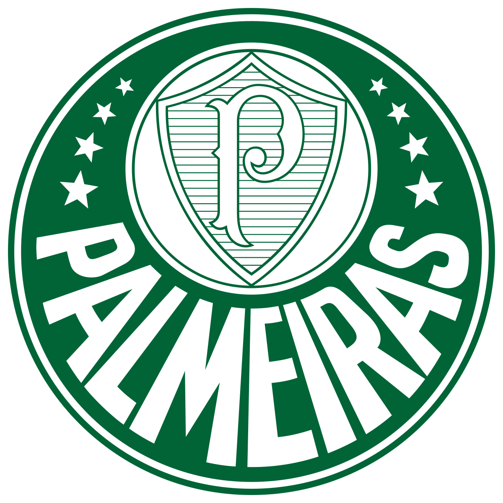

<!-- comentario -->

# Cabeçalho
<h1>Cabeçalho HTML </h1>
<h6>Cabeçalho HTML <h6>

## Descrição do projeto

Um projeto simples, apenas testando e aprendendo boas práticas no github e aprendendo mais sobre a linguagem HTML.

<ul id="menu" align="left">
<li><a href="">Descrição do projeto</li>

</ul>

.
